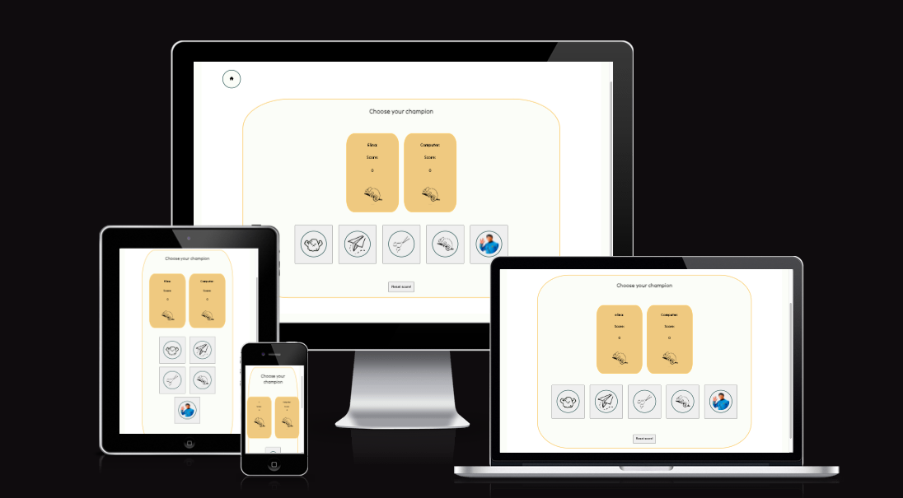

# RPSLS

RPSLS is short for rock, paper, scissor, lizard or Spock. This game is a version of the world wide famous game: rock, paper or scissors. The rules are simple, rock beats scissors, scissors cuts paper and paper covers rock (There is more information about the rules inside the game). In this game there are two more options to choose from, theese are lizard and Spock. This makes the game a bit more advanced and a lot more fun. This game is for everyone who would like to kill some time and have a relaxing moment. Because this game is played against the computer the user can play as many times as he/she likes. 

To use the website, simply navigate to the following URL:
<!--change this link--->
<https://elinaboman.github.io/pp1-dogbakery/>

## Responsive

### Design
The design of this site is very simple using light colors in the background. This is to not distract the user from the content. To make the site a bit more appeling there are orange borders around the main content. The orange color is matched with the orange details in the game-rules area. To create a softer look of the site, the display boxes have a soft border with rounded corners. This is to makes the site playful and easy on the eye.

## Features
### Existing Features
#### Enter username form
  Before entering the rule- and game-area the user has to enter a username. The enterd text will later on be displayd in the rule- and game-area. This makes the game interactive with the user. If the user doesn't enter any text in the text box a message will read above the box, asking the user to insert a username. The game will not continue untill a text is enterd.

  There is a homebutton up in the left corner for the user to get back to the enter-username area at any time.

#### Rule-area
  When the user has choosen a username and clicked the button the rule-area appears. In the rule-area the game rules are explained to the user. The text is combined with a picture that also displays the same rules. This is to make the rules easy to understand as it's easy to get a bit confused by the rules. When the user is ready there is a button that reads: Let's go! When the user clicks this button or anywhere else on the page, the game-area opens. 

 #### Game-area
The game-area exist of two closed squeres that displays the user and the computer choices. The result from each round will be displayed above the boxes with both user and computer choices. The same text will also read the outcome of the game. The winner will score one point from each winning round. Theese point are then displayed inside the player-boxes. The game finishes after ten rounds and the result is displayed. If the user would like to continiue playing there is a reset box that resets the scores. The fun can last forever! 

## Features Left to Implement
There are some features left to implement in this game. There will be a return button next to the home button so the user allways can revisit the rule-area.

## Technologies used
HTML
CSS
JavaScript
Github
Codeanywhere
W3C:s CSS-validator
WRC:s HTML validator
Lighthouse
Balsamiq Wireframes

## Testing
The website has been tested with Google DevTools. Different screen sizes has been tested to work on all devices. Functions of navbar has been adjusted to act as a toggle-bar on smaller devices, while on big screens it appers in the header to the right.

The testing with Google DevTools has helped to localise problems with responsiveness. To solve these problems, media queries has been used for devices with (min-width: 768px) and (min-width: 900px).

There are some estetic malfunctions with the toggle-bar. On smaller screens, when the toggle-menu is clicked, the menu takes up to much space on the left side. This issue will be fixed with adding some padding on the left side. The malfunction is under process.

## Validator Testing
HTML

No errors were returned when passing through the official W3C validator. Validation HTML
CSS

No errors were found when passing through the official (Jigsaw) validator. Validation CSS!
Lighthouse testing

Lighthouse testing

## Unfixed Bugs
Footer buttons
Description: There has been some issues with placement of the footer icons with the links to Facebook, Instagram and Youtube. The placement is intended to spread out evenly, but the icons stick together at the moment.
Status: The issue is under investigation.
Toggle-menu
Description: The toggle-menu as mentioned previously in the testing section has some estetic malfunction. The issue is believed to have to do with padding on the left side.
Status: Fixed.
Since all the pictures are placed in divs instead of img-format, there are no aria-labels in the pictures. This issue has been noted. To fix this problem the pictures could be placed in img-format inside the divs.
Status: Under investigation.
Deployment
This website has been deployed to Github pages. The deployment process starts at GitHub repository and from there navigate to Settings tab. In the dropdown menu scroll down to Pages. Inside the Pages tab, choose Source, Deploy from branch. Under branch, enter main and / (root). Enter save. When the site is deployed there will be a ribbon. The live link can be found here:

Credits
Content

  - Font Awsome:
  The favicon of a little house in the upper left corner has been taken from from the site Font Awesome.

- ChatGPT:
Instructions on how play the games in the rule-area has been written together with ChatGPT. ChatGPT also helped creating the code to make computer decision random. This information has then been adjusted to fit this game. ChatGPT also helped creating the checkWinner function, creating suggestions for how to check the winner.
During code malfunctions ChatGPT has helped trying to find different reasons to why code malfunctioned.

- W3Schools:
The site was used to find information about Javascript in generel. Mostly to find information about for loops, if, else if and else statements.

- Slack comunity:
  Big credits to the slack comunity espesially to Craig Hudson and Niclas Hugdahl who really took their time to help with bugs in the code.

Code Institute tutorials
Mentor Brian O'Hare
My friend Annika Davies
Google search
